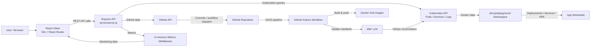
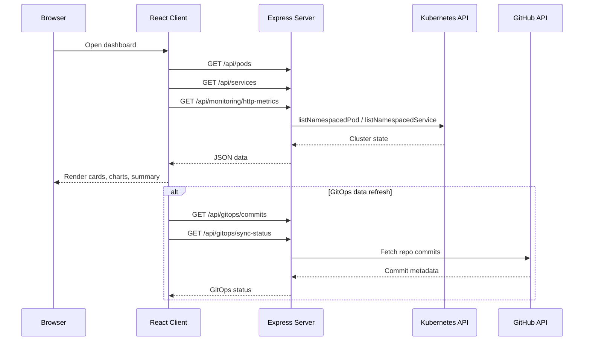
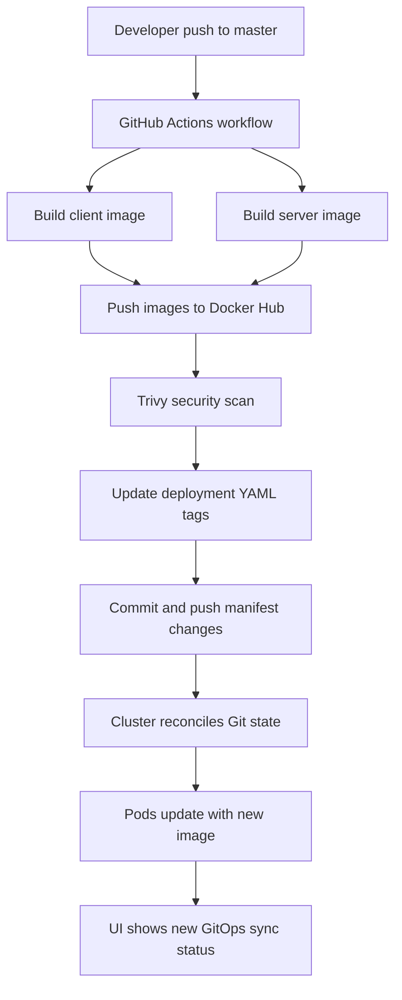
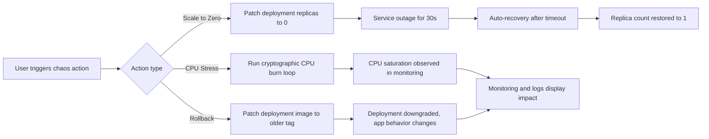

# DevOps Playground

A small Kubernetes-focused DevOps dashboard that demonstrates the relationship between application code, GitOps delivery, container orchestration, and observability in one place.

This project combines:
- a React front-end for visualizing cluster health and pipeline state
- an Express API that queries Kubernetes and GitHub
- Kubernetes manifests for running the app in a cluster
- GitHub Actions for CI/CD and image promotion
- Argo CD-style GitOps flow simulation

## Architecture overview

```text
User Browser
    |
    v
React + Vite Client (client/)
    |
    | fetch /api/*
    v
Express API (server/)
    |
    +--> Kubernetes API (@kubernetes/client-node)
    |
    +--> GitHub API (commit history and workflow trigger)
    |
    +--> in-memory HTTP metrics middleware
    v
Kubernetes Cluster (devopsplayground namespace)
    |
    +--> client Deployment + Service + Ingress
    |
    +--> server Deployment + Service + HPA
    |
    +--> pods, services, logs, autoscaling, chaos actions

GitHub Repository
    |
    +--> GitHub Actions pipeline builds Docker images
    |
    +--> updates k8s/*.yml image tags
    |
    +--> Argo CD / GitOps style sync status displayed in UI
```

## Architectural flow charts

### 1. End-to-end system flow



### 2. Request lifecycle flow



### 3. CI/CD and GitOps deployment flow



### 4. Chaos and resilience flow



## High-level flow

### 1. Front-end layer
The client is a Vite-powered React SPA. It uses React Router to render different dashboards:
- Home: Kubernetes overview and pod/service management
- CI/CD: pipeline status and deployment flow
- GitOps: repository state vs cluster state
- Monitoring: CPU, memory, requests per second, latency
- Logs: Kubernetes logs view
- Chaos: fault injection and resilience experiments

The UI polls key APIs at intervals to keep cluster info up to date.

### 2. API layer
The backend is a Node.js Express server in `server/`.

Main responsibilities:
- expose REST endpoints under `/api`
- query Kubernetes objects using the Kubernetes client library
- fetch GitHub commit history and dispatch workflows
- expose monitoring metrics collected in memory
- trigger simulated chaos events against cluster resources

The core API entrypoint is in `server/server.js`, and the actual logic lives in `server/api.js`.

### 3. Kubernetes integration
The backend uses the Kubernetes client library to inspect and operate on the cluster:
- list pods and services
- delete pods
- restart deployments
- read logs
- read custom resources such as Argo CD application status
- collect resource metrics from `metrics.k8s.io`

This makes the dashboard act like a live cluster console rather than a static mock UI.

### 4. GitOps / CI-CD loop
GitHub Actions is the automation layer for this repo.

Workflow: `.github/workflows/gitops-pipeline.yml`
- runs on push to `master`
- builds the client and server Docker images
- pushes them to Docker Hub
- scans the images with Trivy
- updates the image tags in `k8s/client-deployment.yml` and `k8s/server-deployment.yml`
- commits the tag changes back to the repo

This creates a GitOps-style loop where the repository acts as the desired state and the cluster is reconciled from that state.

## Component structure

```text
DevopsPlayground/
├── .github/
│   └── workflows/
│       └── gitops-pipeline.yml     # CI/CD + image promotion pipeline
├── client/
│   ├── src/
│   │   ├── Pages/                   # Route-based dashboards
│   │   ├── components/              # Header, Nav, UI sections
│   │   ├── App.jsx                 # Router + page layout
│   │   └── main.jsx                # React entry point
│   ├── Dockerfile                  # Client container image
│   ├── package.json                # Vite + React app deps
│   └── README.md                   # Default Vite README
├── server/
│   ├── utils/
│   │   └── metrics.js              # HTTP metrics middleware
│   ├── api.js                      # Kubernetes + GitHub + chaos logic
│   ├── server.js                   # Express app and route registration
│   ├── Dockerfile                  # Server container image
│   ├── message.txt                 # UI-updated system message
│   └── package.json                # Express + K8s backend deps
├── k8s/
│   ├── namespace.yaml              # devopsplayground namespace
│   ├── client-deployment.yml       # Front-end deployment + Service
│   ├── server-deployment.yml       # Back-end deployment + Service
│   ├── ingress.yml                 # Ingress routing for HTTP + API
│   ├── hpa.yml                     # Horizontal scaling policies
│   ├── rbac.yaml                   # Role-based access resources
│   └── ...
├── package-lock.json               # Repo-level lockfile (if used)
├── .gitignore
└── README.md                       # This file
```

## Runtime responsibilities by folder

### `client/`
Built with React and Vite.
- UI shell and route navigation
- cluster dashboard features
- charts and status widgets
- data fetching from the backend

### `server/`
Built with Node.js and Express.
- API server
- Kubernetes API client integration
- GitHub workflow dispatch and commit polling
- metrics middleware and health checks
- fault injection handlers

### `k8s/`
Contains deployment artifacts for running the app in a Kubernetes environment.
- namespace isolation
- separate workloads for client and server
- ingress traffic routing
- autoscaling rules
- RBAC configuration

### `.github/workflows/`
Contains the automation pipeline that:
- builds images
- pushes to Docker Hub
- updates deployment manifests after a successful build

## Key API endpoints

The backend exposes these routes:

- `GET /healthz` — basic liveness check
- `GET /api/pods` — list pods in the namespace
- `GET /api/services` — list services
- `DELETE /api/pods/:name` — delete a pod
- `POST /api/deployments/:name/restart` — rolling-restart a deployment
- `GET /api/demo/message` — read a system message from `server/message.txt`
- `POST /api/demo/trigger` — dispatch a GitHub Actions workflow with UI message input
- `GET /api/gitops/commits` — fetch recent GitHub commits
- `GET /api/gitops/resources` — list deployment/statefulset/daemonset resources
- `GET /api/gitops/sync-status` — read Argo CD application status
- `GET /api/monitoring/http-metrics` — in-memory request metrics
- `GET /api/monitoring/cluster-metrics` — cluster CPU and memory percentages
- `GET /api/monitoring/logs` — fetch pod logs
- `POST /api/chaos/cpu-stress` — trigger CPU stress for a limited period
- `POST /api/chaos/deployments/:name/scale-zero` — simulate outage by scaling to 0
- `POST /api/chaos/deployments/:name/rollback` — simulate a bad deployment rollback
- `GET /api/cluster/info` — fetch node and namespace summary

## Monitoring and observability flow

The system intentionally exposes both application-level and infrastructure-level metrics.

### HTTP metrics
`server/utils/metrics.js` adds middleware that records:
- request count
- route name
- status code category
- duration
- latest request logs

This data is then surfaced in the Monitoring page as:
- requests per second
- latency
- route-level breakdown
- status distribution

### Kubernetes metrics
The server queries Kubernetes metrics APIs and summarizes resource usage into a simple view for CPU and memory.

### Log aggregation
The logs page reads pod logs from each pod in the namespace, parses timestamps, and groups them by severity (INFO/WARN/ERROR).

## Chaos engineering flow

The Chaos page simulates reliability failures in a controlled way:
- scale a deployment to zero for a short outage window
- automatically restore replicas after a timeout
- trigger CPU saturation to consume resources
- rollback a deployment to an older image

This demonstrates resilience patterns and self-healing behavior, making the project useful for practical DevOps demos and walkthroughs.

## Deployment model

The Kubernetes manifests define a namespace called `devopsplayground` and deploy two main apps:

- `devops-client`: front-end workload, horizontally scaled
- `devops-server`: API workload, with HPA and resource requests/limits

Ingress routes traffic to the correct service:
- `/` -> client service
- `/api` -> server service

With TLS configured through cert-manager and an NGINX ingress class.

## Local development

### Front-end
```bash
cd client
npm install
npm run dev
```

The client runs in Vite and calls the backend through relative API endpoints.

### Back-end
```bash
cd server
npm install
K8S_NAMESPACE=devopsplayground npm run dev
```

If you want the API to access cluster resources, make sure your kubeconfig is valid and has access to the target cluster.

### Kubernetes deployment
```bash
kubectl apply -f k8s/namespace.yaml
kubectl apply -f k8s/rbac.yaml
kubectl apply -f k8s/server-deployment.yml
kubectl apply -f k8s/client-deployment.yml
kubectl apply -f k8s/hpa.yml
kubectl apply -f k8s/ingress.yml
```

## Design intent

This project is designed as a learning and demonstration platform for:
- Kubernetes resource visibility
- CI/CD automation and image promotion
- GitOps reconciliation flow
- service and deployment resiliency
- operational dashboards for real-world DevOps teams

It is intentionally opinionated and practical: the UI and API are built to feel like a command center for a live environment, while the codebase remains understandable enough for demos and classroom use.

## Recommended next improvements

- add authentication and RBAC-aware API protection
- externalize configuration with environment-based settings
- add persistent metrics storage and historical dashboards
- add real Argo CD integration instead of simulated status fallback
- add automated tests for API endpoints and component rendering

## Summary

This repository is a full-stack DevOps playground that demonstrates how a modern application stack can be instrumented, provisioned, and visualized across:
- React front-end
- Express API
- Kubernetes operations
- GitHub Actions automation
- GitOps deployment patterns
- monitoring and chaos-driven resilience
